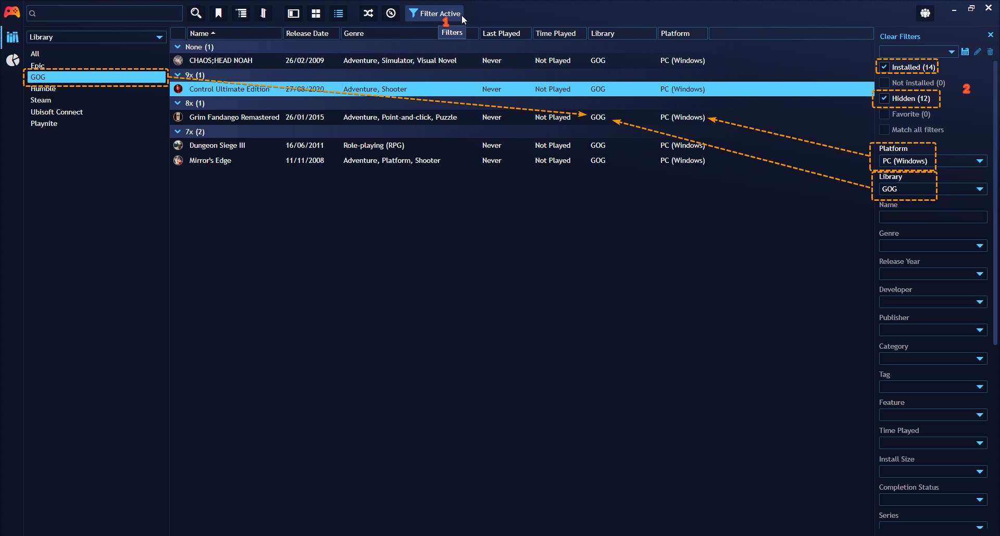
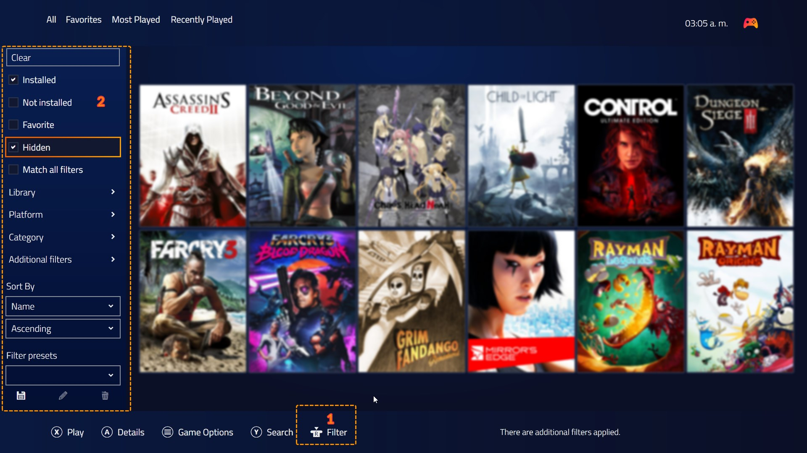
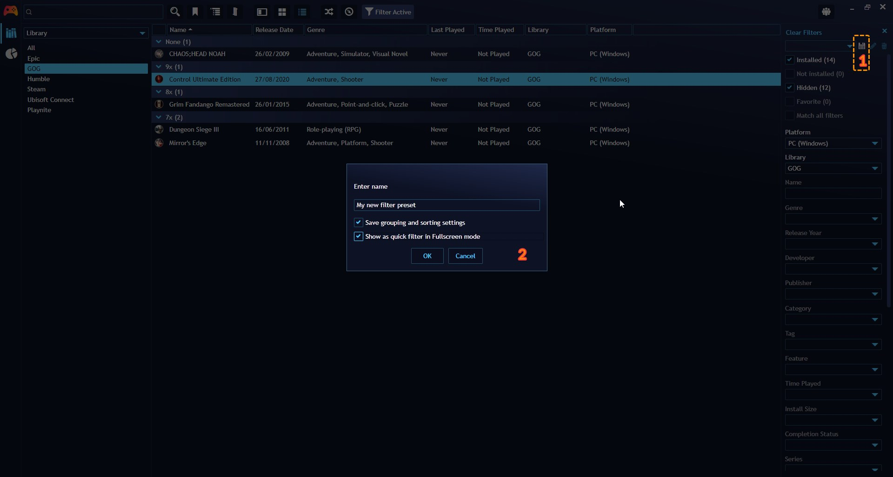
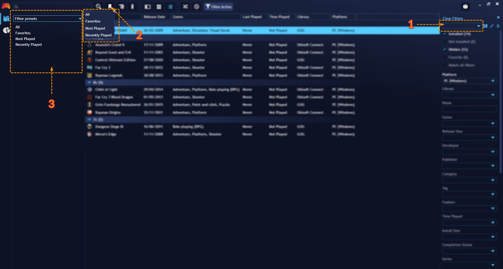
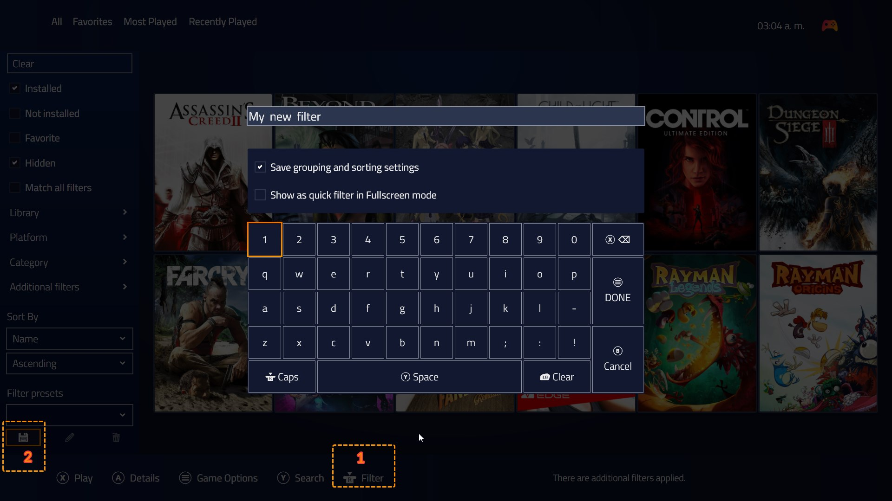

## Filters

---------------------

Filters allow you to quickly sort and organize your game library based on various criteria such as genre, platform, tags, and more and only view the games you want in the Playnite interface.

**On Desktop Mode:**

This can be achieved by opening the **Filter Panel** and selecting the filters you want in each field.

**Tip:** An effective and quick way to switch filters is with the **Explorer Panel**. Selecting an item in this panel will automatically apply this item to the **Filter Panel**

**On Fullscreen Mode:**

This can be achieved by opening the **Filter Panel** and selecting the filters you want in each field.

## Filters presets

---------------------

Filters presets are pre-configured filter combinations that you can save and use later. This simplifies the process of applying specific filter combinations to your library.

Playnite already comes with a set of pre-configured Filter Presets but you can create additional ones. 

**On Desktop Mode:**

Affter creating the filters you want as explained in the previous section, you can click the 💾 button on the **Filter Panel**.

Filter Presets can be activated from:

1. Filters Panel

2. Explorer Panel

3. Filter Presets button in Top Panel

**On Fullscreen Mode:**

Affter creating the filters you want as explained in the previous section, you can click the 💾 button on the **Filter Panel**.

Filter Presets can be found at the top of the Playnite window and can be activated and switched by pressing the **Left Bumper** and **Right Bumper** buttons.

> [!NOTE]
> Make sure to enable **Show as quick filter in Fullscreen mode** option while saving the **Filter Preset** if you want it to be displayed and be usable in Fullscreen Mode.
