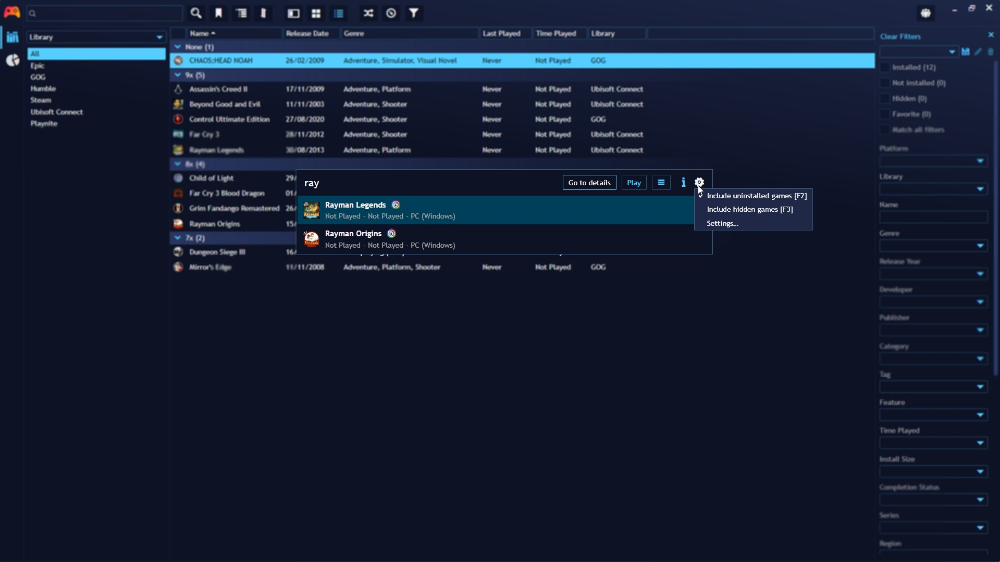
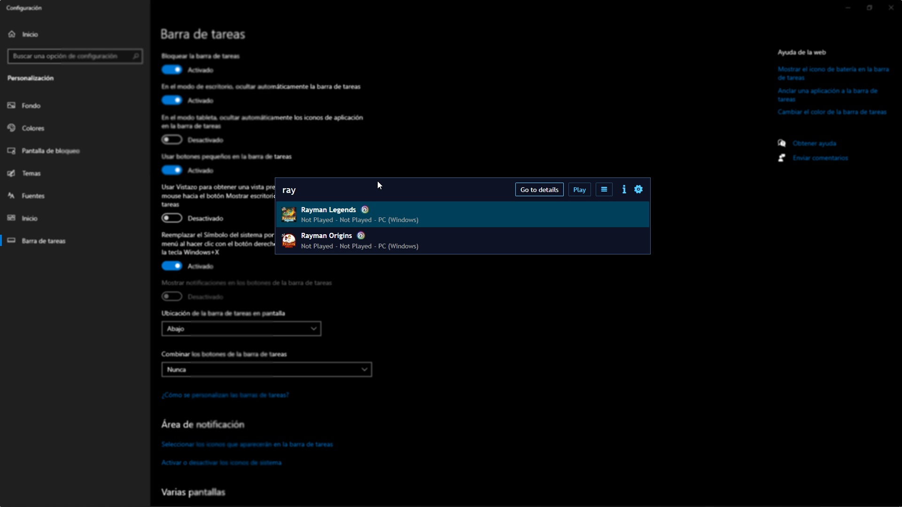
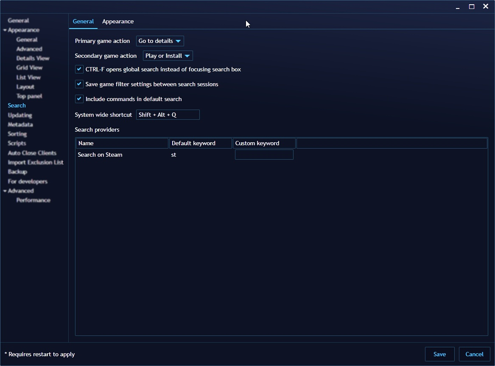
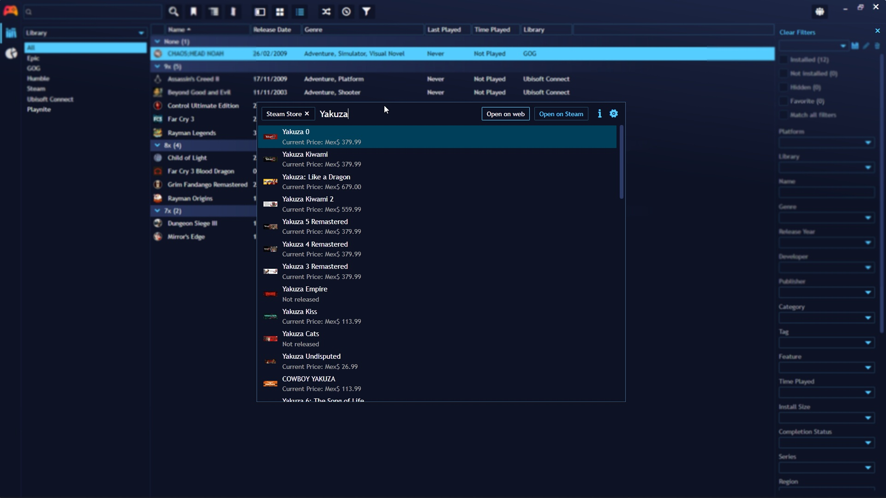

## Keyboard Launcher

---------------------

Playnite includes a Keyboard Launcher, providing you with a quick and convenient way to launch games using your keyboard efficiently. 

This launcher can even be activated when Playnite is not in focus, thanks to its system-wide keyboard shortcut support. It will overlay on top of any other applications or windows currently open on your system.

### Configuration

To configure the Keyboard launcher, navigate to the `Settings` menu and access the `Search` section. By default, it does not have a system-wide shortcut assigned.

### Extensions Support

Extensions can enhance the functionality of the Keyboard Launcher by providing additional search capabilities directly from the launcher interface.

Extensions have a default `keyword` that can be entered in the search box of the launcher to activate but it can be changed in the keyboard launcher settings indicated in the previous section.
