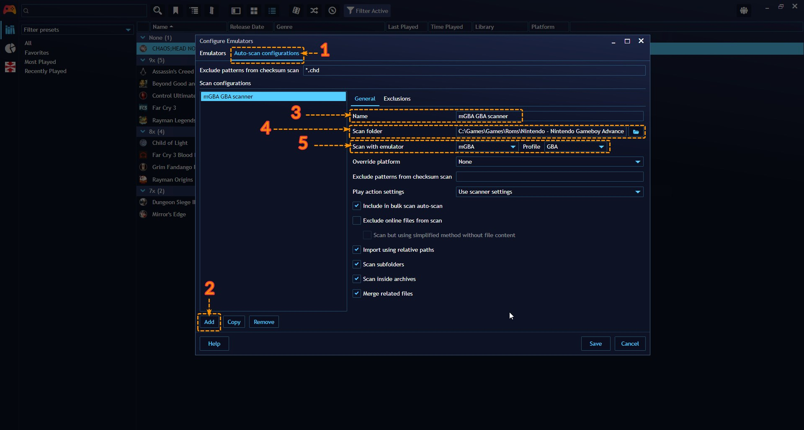

## Adding Emulated Games

---------------------

Once you've configured your emulators and their respective profiles in the previous step, you can start adding emulated games to your Playnite library.

This section will guide you through configuring a scanner that Playnite will use to automatically add these games to your library.

> [!NOTE]
> How games are imported is controller by an emulator and its selected profile. Built-in emulators/profiles use several different method how to detect a game so it's important that your emulators configuration is correct!

> [!NOTE]
> [Custom profiles](addingNewEmulators.md#configuring-a-custom-emulator-profile) primarily matches games by specified file extensions. If you want to increase accuracy of the import, make sure you also assign correct platforms to the profile and that those platforms have [platform specification](../../library/libraryManager.md#platform-specification) assigned to them.

## Auto-scan configurations

---------------------

#### Creating an Auto-Scan configuration

Navigate to `Main menu` > `Library` > `Configure emulators…` on Playnite Desktop Mode to open the Emulators configuration window.

Afterwards, continue with the following:

1. Select the `Auto-scan configurations` tab

2. Click the `Add` button to create a new scan entry

3. Input the `Name` you want for the scanner

4. In `Scan folder`, select the folder where your games are located

5. In `Scan with the emulator`, select the emulator you want to use to scan first and afterwards select a `Profile` used by the emulator that will be used to run these games.

6. Modify any additional configuration you wish to and finally click `Save` to finish.

   

#### Using an Auto-scan configuration to import emulated games

After creating an Auto-scan configuration, you can start using it to import emulated games using the following methods:

1. **Automatic:** You can start games scan by navigating to `Main menu` > `Update game library` > `Update emulated folders`. This option will automatically add detected games without requiring user input

2. **Automatic during library update:** By default, Playnite will scan for emulated games during library update. This behavior can be changed globally for all scan configurations with the `Scan emulation folders` option in `Settings` > `Updating` or you can configure this option for individual scanners in `Main menu` > `Library` > `Configure emulators` > `Auto-scan configurations`

3. **Manual:** Navigate to `Main menu` > `Add Game` > `Emulated Game` and follow the instructions.

> [!NOTE]
> Playnite by default groups multi-disc games under one game entry. You can alternatively split or merge these via right-click menu after selecting games on import list. Right-click menu also gives you an ability to change platform and region in bulk.

### Exclude patterns

Exclude patterns are used during the checksum scan. When a file matches any of the specified patterns, its checksum won't be calculated, and the game will be imported based on other ROM properties, mainly the file name. While this approach can significantly speed up the scanning process, it will also result in less accurate imports.

> [!NOTE]
> A checksum serves as a **unique** identifier for a game file. Playnite uses this identifier to check if the file is available in Playnite's emulation database and retrieve information about it, like game [metadata](../../library/games/metadata.md).

Multiple patterns can be specified by separating the list with comma, for example: `*.chd,*.iso`

> [!NOTE]
> `chd` files are excluded by default because there are currently no records for them in emulation database Playnite uses for game matching.

### Excluding files and folders from import completely

Scanner configurations allow to specify a list of files and folders to be completely ignored during emulation scan. This list can be configured through the  `Exclusions` tab. Files and folders can be also added directly from scan results, via right-click menu on scanned games/files.

The exclusion list should consist of relative file and folder paths, which are relative to the scan folder specified in the scanner's settings. For example, if you want to exclude a file like `c:\test\dir\somefile.rom` that is detected by a scanner set to scan the `c:\test\` folder, you would set the exclusion to `dir\somefile.rom`. Alternatively, you can use `dir` to exclude the entire `dir` folder and all its contents from the scan.

### Exclude online files

Enabling this option will skip the scanning of files stored in cloud storage paths that are not currently downloaded. This helps prevent files from being downloaded during the scanning process.

The currently supported cloud storage platforms include:
- Google Drive
- Dropbox
- OneDrive

### Relative path support

When the `Import using relative paths` option is enabled, Playnite attempts to import emulated games, specifically the paths to ROM files, using relative paths. This is achieved by replacing specific parts of the file path with `{PlayniteDir}` or `{EmulatorDir}` [variables](../../advanced/gameVariables.md) where applicable, provided that the ROM location is within the emulator's or Playnite's folder.

## Tips

---------------------

- Make sure your emulators are correctly configured with their respective BIOS files and settings for the best emulation experience.
- Keep your emulated game ROMs organized in a dedicated directory for easy management and scanning by Playnite.

With Playnite's emulation support, you can enjoy your favorite retro games alongside your modern library, all within a unified gaming platform.
