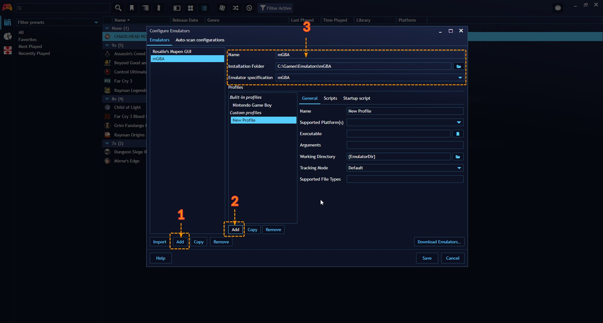

## Adding new emulators

---------------------

To start adding a new emulator, navigate to `Main menu` > `Library` > `Configure emulators…` on Playnite Desktop Mode to open the Emulators configuration window.

Playnite has a support for handling and importing of emulated games. The support is implemented in two ways:

### Automatic Emulator Detection (Built-in support)

Playnite features an automatic emulator detection system that can identify [several known emulators](https://github.com/JosefNemec/Playnite/tree/master/source/Playnite/Emulation/Emulators) installed on your system that, with support to automatically configure them. This also includes import of emulated based on libretro game database.

To automatically import an emulator follow these steps:

1. Click `Import` to open the Emulation import wizard window
2. Click `Scan folder` to open a files explorer window, select the folder where your emulator is located and wait for the scan to finish.
3. Verify that the emulators you want to import are being displayed in the list and finally click `Import` to add the emulator.

If your emulator was not found, it means that Playnite doesn't have an automatic configuration for it. Continue to the next section to learn how to manually add the emulator.

> [!NOTE]
> If you find that an emulator is missing and you think that it should be added to built-in supported emulators list, please [open new issue on GitHub](https://github.com/JosefNemec/Playnite/issues/) for it to be added.

### Manual emulator configuration

If Playnite doesn't automatically detect your emulators, or if you prefer manual configuration, you can add emulators manually.

To manually add emulators:

1. Click the `Add` to create a new emulator entry.
2. Enter the emulator information like the emulator `Name` and `Installation Folder`. Also select your emulator in `Emulator specification` if it's available
3. Select `Add` to create an emulator profile. If you selected an `Emulator specification` in the previous steps, automatic configurations will be available to select. If you wish to use your own configuration or there is not any configuration available select `Custom profile` and proceed to the next section

#### Configuring a custom emulator profile

---------------------

After creating a manual **Custom profile** in the previous step, you'll need to configure it before using it. For this example we'll be using the mGBA emulator:

1. Input a `Name` for the profile and select the `Supported Platform(s)` for the profile. If your platform is not available in the dropwdown, you can add aditional ones in the **Library Manager**, located in `Main menu` > `Library` > `Library Manager…`

2. Select the emulator executable

3. Input the `Arguments`. To know the arguments, refer to the specific emulator documentation online. Looking online, we've found this [documentation]([mGBA - Emulation General Wiki](https://emulation.gametechwiki.com/index.php/MGBA)):

`mgba` refers to the emulator executable. The `options` bracket is optional but we'll use the `-f` graphics option to start the emulator in fullscreen and finally `file` refers to the game file path.

The full `Arguments` line we'll end with is `-f "{ImagePath}"`.

> [!NOTE]
> The `{ImagePath}` part is a game variable that points to the game image/rom path. Generally most emulators accept this argument but it will depend in the specific emulator. For a detailed explanation of game variables during game start refer to [Game Variables](../../advanced/gameVariables.md)

4. Configure the `Supported File Types` available in the documentation. Alternatively if you didn't find any, it is suggested to see what file types are available in the file selection dialog in the emulator itself.

In this example, we end with `gba,zip,7z,elf,agb,mb,rom,bin`

> [!NOTE]
> The supported file types list must be separated with a comma (,), not contain the period (.) or spaces!

5. After finishing, click `Save` to save the changes.

> [!NOTE]
> A lot of arcade emulators require ROM file to be passed via command line argument as a file name without complete path or file name without an extension. In that case you can use `{ImageName}` or `{ImageNameNoExt}` (See [game variables](../../advanced/gameVariables.md)), instead of {ImagePath} which contains full path to a ROM file.