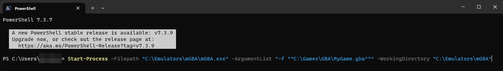

## Troubleshooting

---------------------

If you encounter any issue when using built-in emulator configurations/profiles, please [open new issue on GitHub](https://github.com/JosefNemec/Playnite/issues/) to let us know and we will fix it.

### Game runs properly when launched manually from an emulator but not from Playnite

Playnite uses [command line arguments](https://www.bleepingcomputer.com/tutorials/understanding-command-line-arguments-and-how-to-use-them/) to instruct specific emulators on which game to start. However, some emulators may exhibit different behavior when a game is launched via command line compared to when launched from the emulator's user interface. Consequently, you may notice games behaving differently when launched from Playnite.

This discrepancy can originate from either Playnite or the emulator:

- **Emulator issue:**
 
  If the issue lies with the emulator, it means that Playnite is correctly passing the arguments, but there is a bug in the emulator that causes games to run poorly or exhibit an issue when started from the command line. In such cases, the only solution is to contact the emulator's developers for further assistance.

- **Playnite issue:**
 
  If the issue is within Playnite, it means that Playnite is not passing the correct arguments to the emulator. This often occurs when an emulator has been updated and now requires a different set of arguments, especially when using Playnite's built-in emulator profiles, or if you've configured custom profiles with incorrect arguments.

**What can you do?**

First you'll need to determine if the issue originates in Playnite or the emulator itself. To test this, you can run the emulator manually from the command prompt using the same command line arguments that Playnite uses, which can be found in the emulator's configuration view.

As an example, we'll use the emulator configuration created in the tutorial to create emulators [here](addingNewEmulators.md#manual-emulator-configuration).

First we have to know the paths of the emulator and the game file. For this example, we'll use the following:

- Emulator path: `C:\Emulators\mGBA\mGBA.exe`
- Game file path: `C:\Games\GBA\MyGame.gba`

The arguments in the profile configuration is `-f "{ImagePath}"` but since we can't use [game variables](../../advanced/gameVariables.md) outside of Playnite, we need to replace them with the real path. Replacing the `{ImagePath}` variable, the arguments will be converted to `-f "C:\Games\GBA\MyGame.gba"`. The same should be done for the `Working Directory`.

Now that we have our arguments, we can create our full command line in this format:

```powershell
Start-Process -Filepath "<EmulatorPath>" -ArgumentList '<Arguments>' -WorkingDirectory "<EmulatorDirectory>" 
```

Using the information we obtained, this will be the correct command line:
```powershell
Start-Process -Filepath "C:\Emulators\mGBA\mGBA.exe" -ArgumentList "-f ""C:\Games\GBA\MyGame.gba""" -WorkingDirectory "C:\Emulators\mGBA"
```

> [!NOTE]
> Quote characters `"` in the ArgumentList need to be escaped and replaced with double quotes `""` to be properly processed like in the example.

Now, open Powershell, input the full command line and press enter:



Afterwards, it will be possible to determine if the issue originates from Playnite or the emulator:

- **Game still has the same issue:**
  
  This means that it's an issue in the emulator itself and the only solution is to contact the emulator's developers for further assistance.
- **Game doesn't have any issue:**
  
  This means that it's an issue in Playnite. If you used a manual configuration, verify that your emulator configuration is correct. If you used an automatic built-in emulator profile, please open new issue in Playnite's repository for the profile to be updated and fixed.

### Emulator doesn't start

Usually occurs when using a custom profile if the executable path is not properly configured. Make sure that problematic profile points to an existing file.

### Emulator is not being imported

Playnite either doesn't have a profile for the emulator or the emulator has been updated in a way that prevents Playnite from detect it. In both case, please report an issue on GitHub

### Emulator starts, but game is not launched

This is usually caused by wrongly configured profile `Arguments` that are passed to the emulator. Make sure that arguments are configured according to what the selected emulator supports, which can be verified by consulting its documentation.

### Game ROMs are not detected

When using custom emulator configurations, Playnite uses the `Supported File Types` profile property to scan ROM files. Make sure that you have specified the correct file extensions.