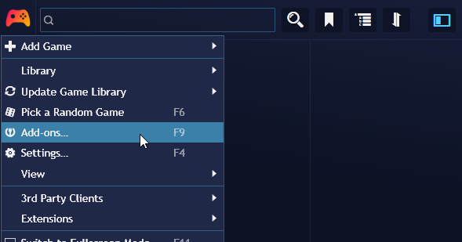
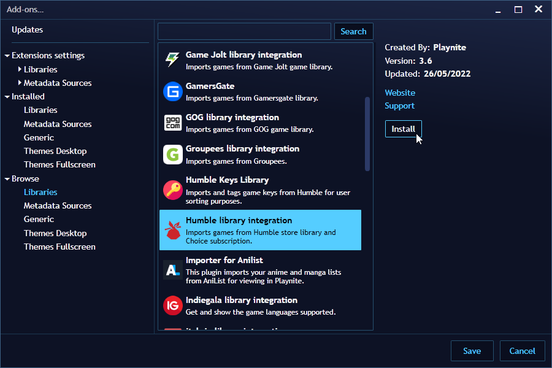
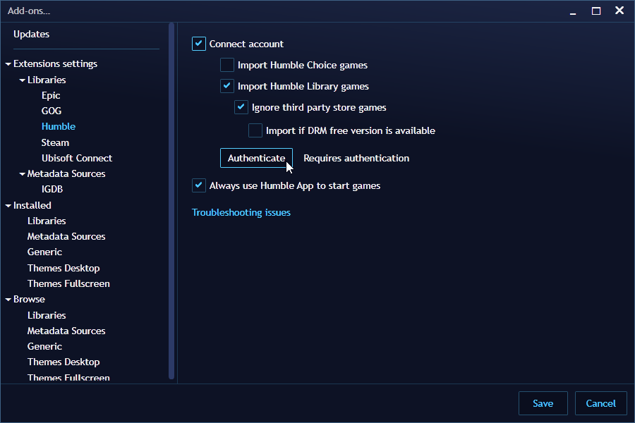
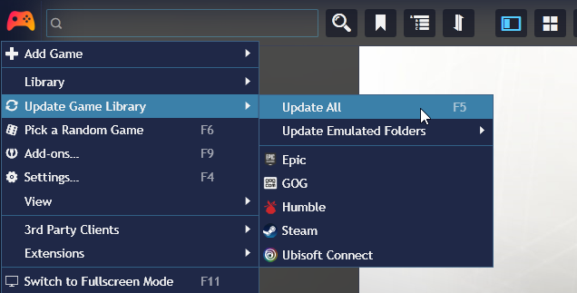
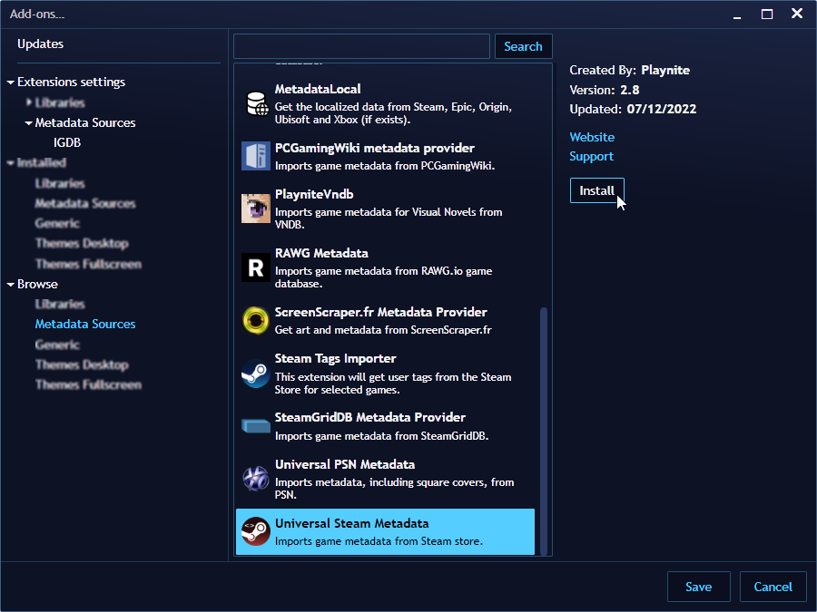
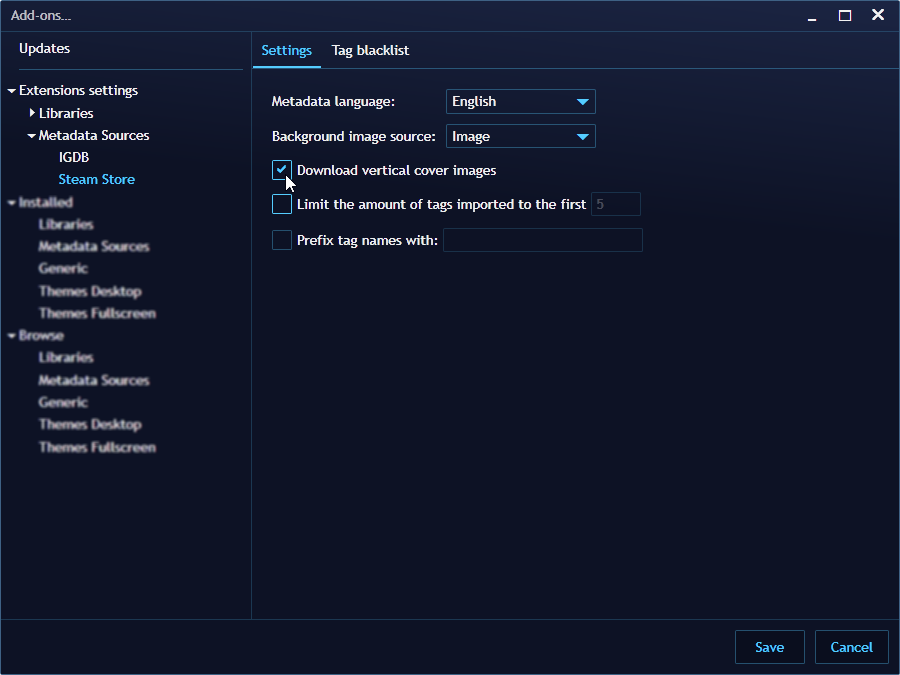
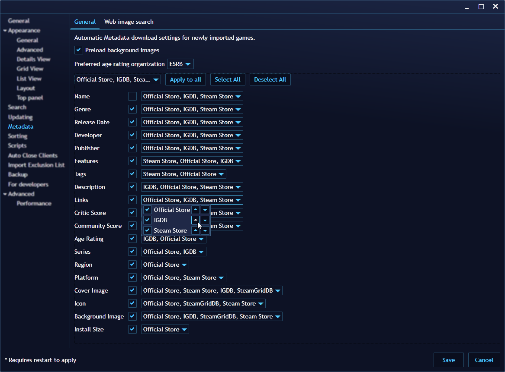

## Installing extensions

---------------------

During the first-time setup, Playnite offers to install and configure library integrations developed by the Playnite development team. However, additional extensions created by the community are also available for installation.

Available extensions can be found on the Playnite addons database. This database can be accesed from the web [here](https://playnite.link/addons.html) or in Playnite itself with instructions in the next section.

### Installing and configuring additional Library integrations

1. Open the Playnite main menu by clicking the Playnite icon.
2. Navigate to `Main menu` > `Add-ons…`, select `Browse` followed by `Libraries`.

   

3. A list of available library plugins will be displayed. To install them, select the desired plugins and click `Install` on the right side. After finishing, click `Save` and restart Playnite when prompted.

   

4. After restarting Playnite, you can configure the newly installed library extensions by navigating to `Add-ons…` and accessing the `Extensions settings` and `Libraries` sub-section.

   

5. Finally, you can import games from the added libraries using the `Update Game Library` option in the main menu.

   

### Installing additional Metadata providers

Playnite relies on data provided by third-party services to obtain game information and media. This data is referred to as metadata. By default, Playnite includes a metadata plugin that retrieves data from [IGDB](https://www.igdb.com/). However, additional plugins created by the community are available for installation.

To install additional metadata plugins:

1. Open the Playnite main menu by clicking the Playnite icon.
2. Navigate to `Add-ons…`, and select `Browse`, followed by `Metadata Sources`.

   

3. After installing new metadata plugins and restarting Playnite, you can configure them in the `Metadata Sources` section under `Extension settings`.

   

#### Configuring Metadata Download

You can configure the order in which Playnite will request data when downloading metadata.

The configured order determines the sequence in which Playnite requests data, stopping at the first metadata extension that provides it.

   