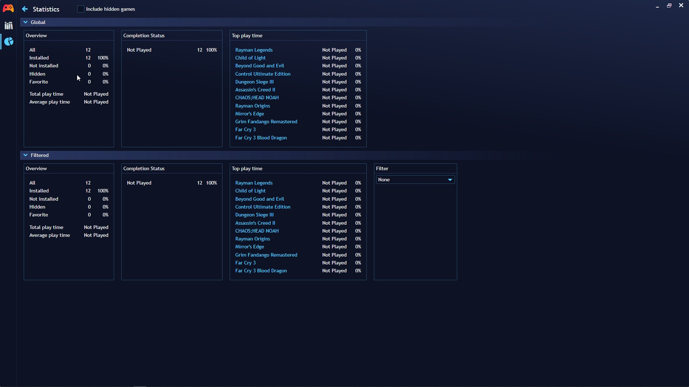

## Game Library Statistics

---------------------

Playnite provides detailed statistics about your game library, including playtime, game completion, and more. Discover how to access and interpret these statistics.

You can access this statistics view in two ways:

1. **Via the Sidebar:**
   
   - Click on the "Statistics" option in the sidebar to open the statistics view.

2. **Using the Main Menu:**
   
   - Click on `Main menu` > `View` > `Statistics` to open the statistics view.

