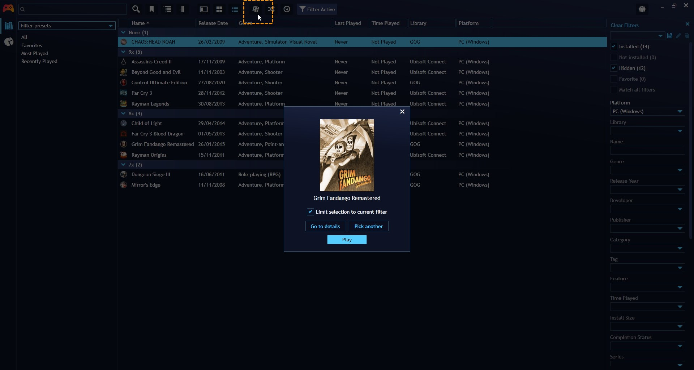

## Random game picker
---------------------

Can't decide what to play next? Playnite's random game picker can help you choose a game at random from your library. Learn how to use this fun feature.

### Desktop Mode

This feature can be activated by clicking the 🎲 button in the **Top Panel**.

You can configure wheter this button should be displayed in `Settings` > `Appearance` > `Top Panel`.

### Fullscreen Mode

Select `Pick a Random Game` in the main menu.