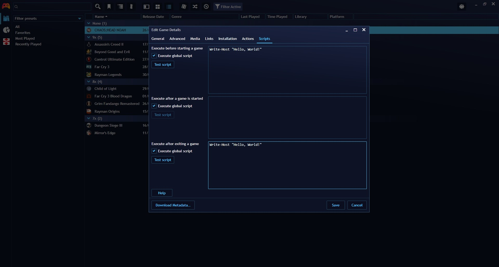
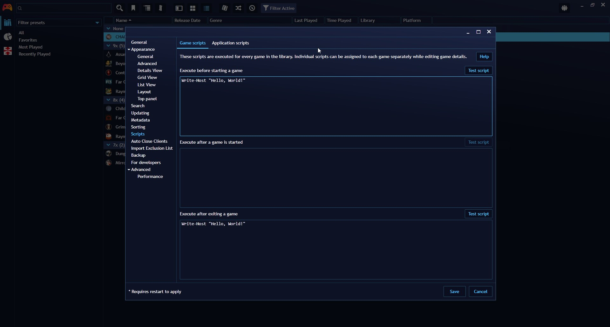
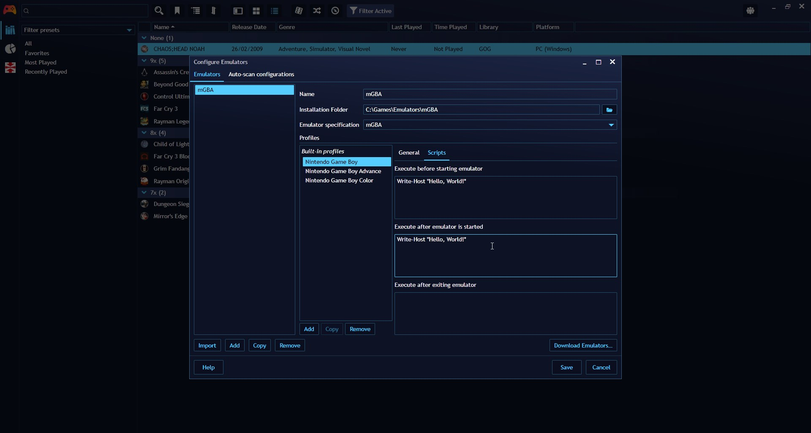

## Scripting Support

---------------------

Playnite offers scripting support, allowing you to extend its functionality through custom scripts. Playnite supports **PowerShell** scripts, enabling you to automate tasks and enhance your gaming experience. 

> [!NOTE]
> PowerShell support requires PowerShell 5.1 to be installed on your machine. Windows 7 users may need to [install it manually](https://www.microsoft.com/en-us/download/details.aspx?id=54616) (Windows 8 and 10 include it by default). Playnite currently does not support newer PowerShell Core runtimes (PowerShell versions 6 and newer).

Custom PowerShell scripts can be assigned to game events via Playnite's UI. Unlike extensions that require custom development, game scripts allow you to execute scripts for various game-related events at multiple levels:

- **Global**: Executed for every game in your library.
- **Emulator**: Executed for specific emulator profiles used by multiple games.
- **Game**: Executed for a specific game.

Configured Scripts are executed in the following order:

| Event | Description                     | Execution order            |
| ----- | ------------------------------- | -------------------------- |
| Pre   | Before game is started.         | Global -> Emulator -> Game |
| Post  | After game is started running.  | Game -> Emulator -> Global |
| Exit  | After game has stopped running. | Emulator -> Game -> Global |

> [!NOTE]
> All scripts are executed synchronously, meaning that Playnite will wait for a script to finish and will block any other execution, including the UI, as the script runtime runs on the main thread.

> [!NOTE]
> Game scripts are not the same as [script extensions](../../../tutorials/extensions/intro.md), which provide extended functionality for more complex scenarios.

### Configuring scripts

---------------------

**Game level:**

1. Select the games you wish to configure scripts for in the Playnite user interface.

2. Right click the game(s), select `Edit…` to open the `Game Edit` window and select the `Scripts` tab on top.

**Global Level:**

1. Go to `Main menu` > `Settings…` > `Scripts`

Scripts of this level can be set to be executed on game and application events.

**Emulator Level:**

1. Navigate to `Main menu` > `Library` > `Configure Emulators…` to open the emulators configuration window
2. Select a configured emulator, select an **Emulator Profile** and then select the `Scripts` tab on the right

### Testing scripts

Testing can be done by pressing the `Test Script` button if it's available next to the text box where you can input the script. If it's not available, you can open a Powershell window for testing in `Main menu` > `Extensions` > `Interactive SDK Powershell`.

### Notes

---------------------

- If a game has an installation directory set and that directory exists, Playnite will set the current working directory of a script runtime to that installation directory.

- All scripts share the same runtime environment for a single game session, allowing you to share data between them by declaring variables on the global scope (e.g., `$global:testVar = "This is a global string"`).
