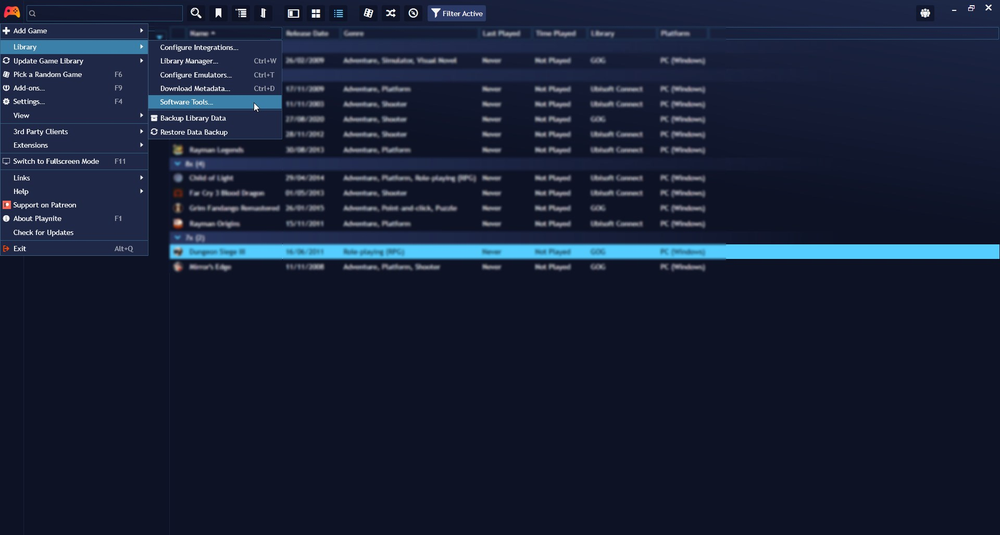

## Software Launch Support

---------------------

> [!NOTE]
>This feature is only available for Desktop Mode.

Playnite not only helps you manage and play games but also offers support for importing and launching other software applications. Here's how to import and organize your software library.

### Importing Software

To open the **Software Tools** window, navigate to `Main menu` -> `Library` -> `Software Tools`.

In this window, you can add software tools to launch directly from Playnite. Click the `Add` button to create a new entry, or use `Import file…` to streamline the software information setup.

Enabling the **Show on sidebar** option will make this software display in the sidebar for quick access.

### Launching Imported Software

You can launch the imported software in several ways:

1. Right-click the Playnite icon in the tray and navigate to `Tools`.

2. If you've enabled the `Show on sidebar` option for your imported software, you'll find it conveniently located in the sidebar.

