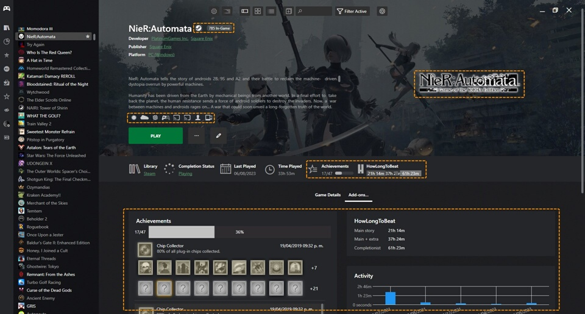
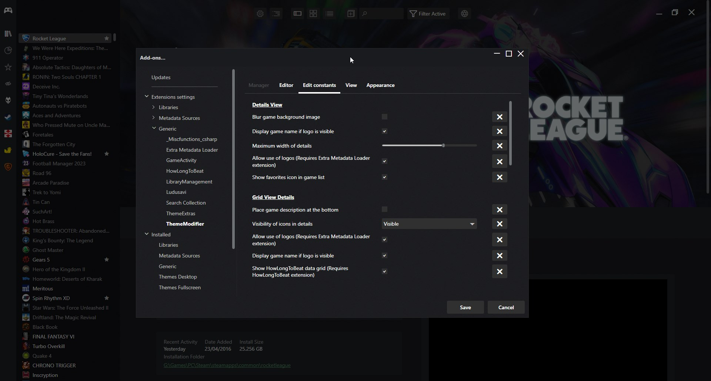

## Installing Themes
---------------------

To install a theme in Playnite, follow these steps:

1. In Playnite Desktop Mode, navigate to `Main menu` > `Add-ons…` > `Browse`  and finally `Themes Desktop` or `Themes Fullscreen` depending of the type of theme you want to install.

2. Select the theme you want to install.

3. On the right side, click the `Install` button and wait for the theme to download

4. Click `Save` on the bottom of the window

5. Playnite will prompt you to restart to finish the installation.

Alternatively, you can browse and start a theme installation from the [Playnite addon database on the web](https://playnite.link/addons.html).

## Applying or changing the active theme

### Desktop Mode

1. Navigate to `Main menu` > `Settings…` > `Appereance` > `General`

2. Select the theme you want to apply in the `Theme*` dropdown

3. Click `Save` on the bottom of the window and restart when prompted

### Fullscreen Mode

1. Open the **Menu** by pressing the `Back`/`Select` button or by clicking the Playnite icon on the Top panel

2. Navigate to `Settings` > `Visuals`

3. Select the theme you want to apply in the `Theme*` dropdown

4. Exit the menu and restart when prompted

## Additional features in themes
---------------------

### Additional functionality

Custom themes not only transform the visual aspect of Playnite but can also introduce additional functionality.

The specific enhancements and additions can vary between themes, making it advisable to consult the theme's documentation for detailed information.

### Custom UI elements

Extensions can provide custom elements to Playnite that custom themes can use, ranging from videos, logos, achievements, additional data like HowLongToBeat, DLC, reviews, news... The possibilities are endless!

**Example of custom theme with support for extensions custom UI elements:**

You can browse the Playnite addons database to explore and find what is available.

> [!NOTE]
> Currently it is required to use custom themes to use any additional custom UI element provided by extensions. It's also required that the specific theme supports the specific element provided by the plugin to display and use it.

### Configuring themes

Currently Playnite doesn't offer a native way to configure themes but a community solution is available with the [ThemeModifier extension](https://playnite.link/addons.html#playnite-thememodifier-plugin), which provides a way for custom themes for Desktop Mode to offer configuration options for users.

For additional information regarding this functionality, refer to the extension and themes documentation.