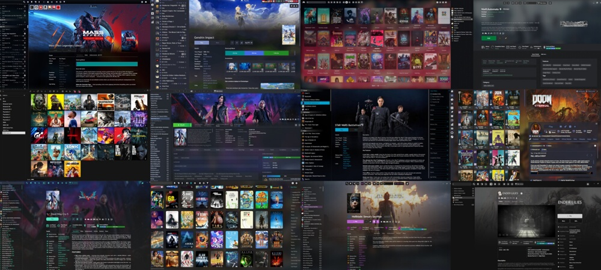
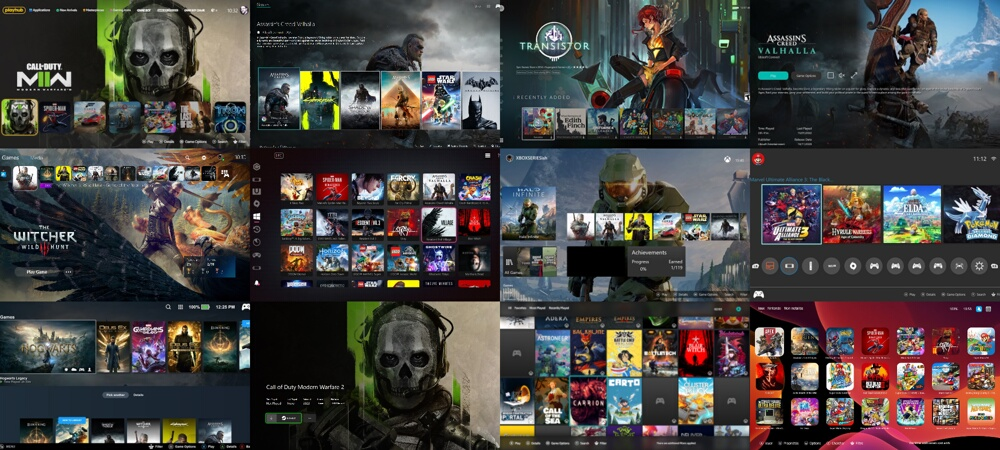

## Overview

---------------------

Playnite allows you to customize the appearance of your game library with themes. Themes are a collection of visual modifications, including background images, colors, visual and layout changes and even adding additional features that can transform the look and feel of Playnite.

Whether you want a sleek and modern design, emulate the design of another platform or simply want a new fresh look, themes give you the power to personalize your gaming experience and truly make Playnite your own!

**Desktop mode themes examples:**

**Fullscreen mode themes examples:**

