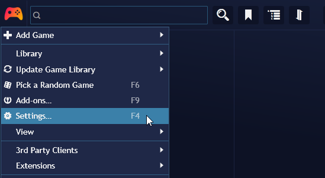
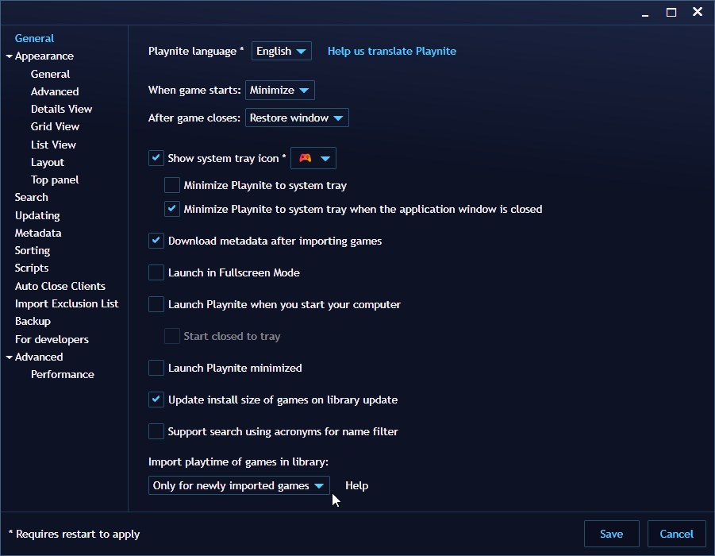
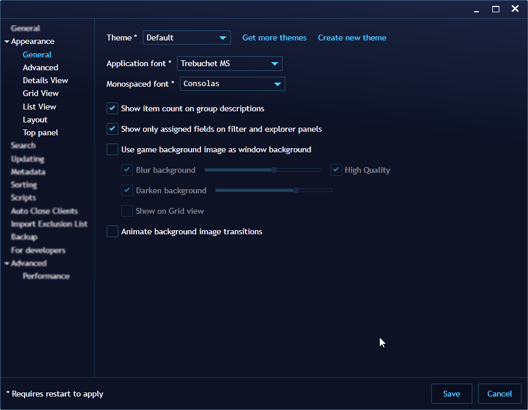
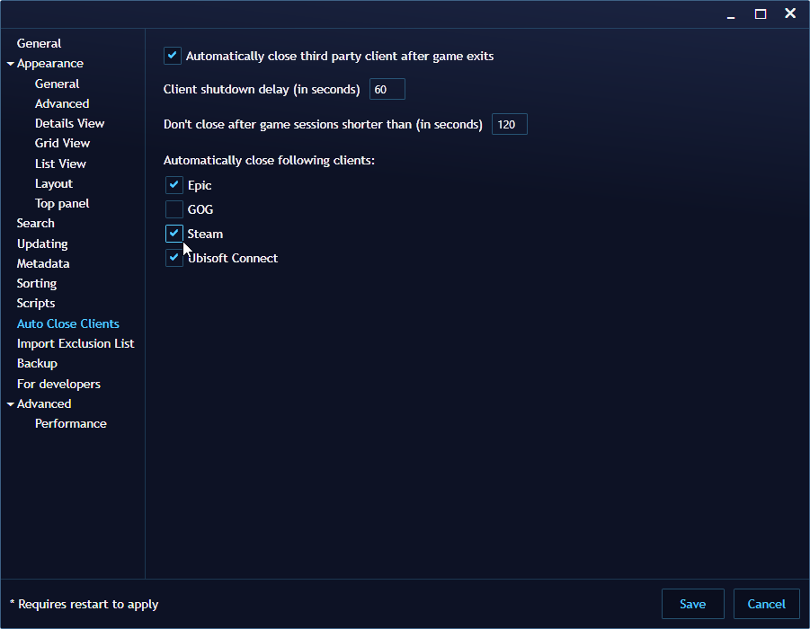

# Configuring Playnite

---------------------

## Accessing Playnite settings

To access Playnite's settings:

### Desktop Mode
1. Click the `Playnite` icon to open the main menu.
2. Click `Settings…`

   

### Fullscreen Mode
1. Press the `Start` button in your controller
2. Navigate to `Settings`

> [!NOTE]
> Each Playnite mode has its own unique configuration settings that apply exclusively to that mode, including appearance aspects like the active theme and more. These mode-specific settings can only be modified within their respective mode settings.
> 
> Additionally, Desktop mode contains certain settings and configuration that impact Playnite's behavior and functionality across both modes.

### General configuration

In the **General** section of the settings, you'll find options to configure Playnite's behavior when starting, minimizing, and whether Playnite should start in Fullscreen Mode, among other settings.

### User Interface and appearance configuration

Playnite provides numerous customization options to tailor the user interface and appearance to your preferences. Customize the visibility of elements, change the application font, adjust the placement of panels, modify the height of covers, adjust spacing, and more.

Explore these options in the `Appearance` section to make Playnite your own.

### Importing Playtime from Third-party Libraries and Services

In this settings section, you'll find the "Import playtime of games in library" setting. This setting configures whether playtime provided by third-party services should be imported into Playnite during library updates.

> [!WARNING] 
> Keep in mind that support by the library plugins responsible for handling the games is required to use this feature. Only library plugins that internally obtain playtime data from their respective service will allow Playnite to import it. This usually requires the user to be logged in and/or configure a key in the specific plugin settings page.

The following modes are available for this setting:

| Mode                          | Description                                                                                                     |
| ----------------------------- | --------------------------------------------------------------------------------------------------------------- |
| Always                        | Imports playtime for new imported games added during library updates and existing games in Playnite's database. |
| Only for newly imported games | Imports playtime only for new imported games added during library updates.                                      |
| Never                         | Never imports playtime under any circumstance.                                                                  |

> [!NOTE]
> If you want to keep your playtime always in sync with your game library, use the "Always" setting

### Auto Close Clients

You can configure Playnite to automatically close game clients after you close a game in the **Auto Close Clients** section. This ensures that game clients are only running when needed and not wasting unnecessary resources.

### Backups support

Playnite allows you to configure automatic backups for safety. These backups can be used to restore Playnite to a previous state in case of installation issues, library corruption, or when moving a library to another PC.

For more information, refer to [Backup](../library/backup.md).

## Installing library integrations and extensions

See [here](../features/extensionsSupport/extensionsSupportOverview.md).