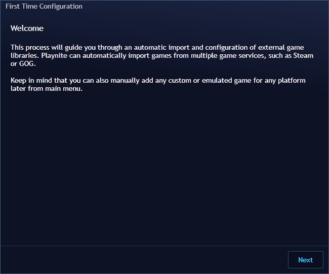
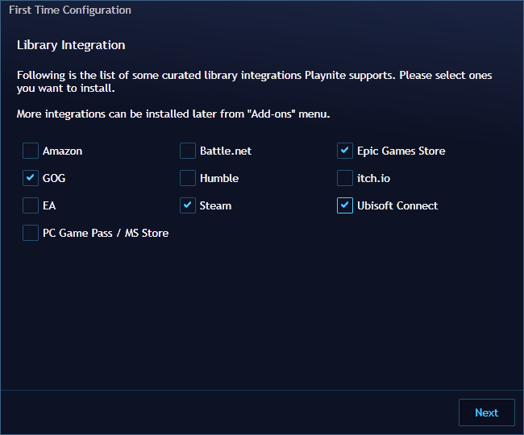
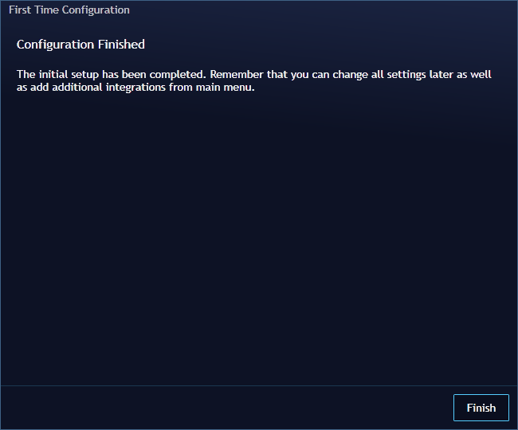

# First Time Configuration Wizard
---------------------

The first time you open Playnite, you will encounter the First Time Configuration wizard, designed to help you set up your gaming library efficiently.

> [!NOTE]
> It's important to mention that any configuration or action performed during the wizard can be adjusted later in the add-ons configuration window, even after it completes. For more information refer to [here](../features/extensionsSupport/installingExtensions.md).

Follow these steps to get started:

1. **Library Integrations Selection:** On the wizard screen, carefully follow the on-screen instructions.
- Select the library integrations you want to install and use.
- Click `Next` Playnite will proceed to download and install your chosen library extensions.

   

2. **Configuration for Installed Plugins:** After the installation of the library extensions, you'll be presented with a configuration screen for each plugin. Make sure to configure each one according to your preferences and requirements.

   > [!NOTE]
   > Note that, for most integrations, you may need to authenticate to import all the games in your account. Authentication requirements can vary for each library integration.

3. **Finalize Setup:** Once you've completed the configurations for each of the integrations, click "Finish" to conclude the first-time setup configuration.

   

4. **Importing Games:** With the setup complete, Playnite will launch in Desktop Mode and start importing games from the libraries you configured.

5. **Adding additional games:** You can also add games into the library manually, game import is not limited to library integrations only. For emulated games see [this page](../features/emulationSupport/addingEmulatedGames.md). For any game in general see [this page](../library/games/addingGames.md#manually).

This wizard ensures that Playnite is tailored to your gaming library, making it a seamless and personalized experience from the very start. You can always revisit and adjust these settings later to suit your changing preferences in the add-ons configuration window. For more information refer to [here](../features/extensionsSupport/installingExtensions.md).