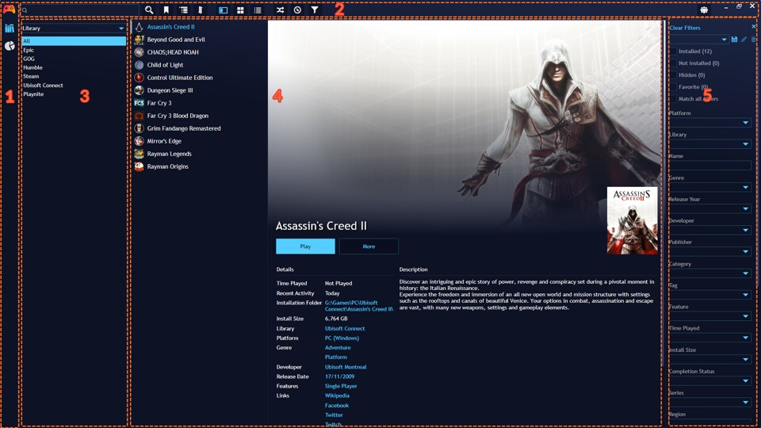
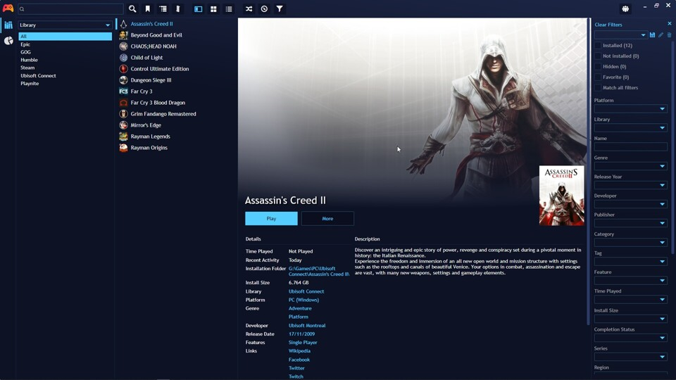
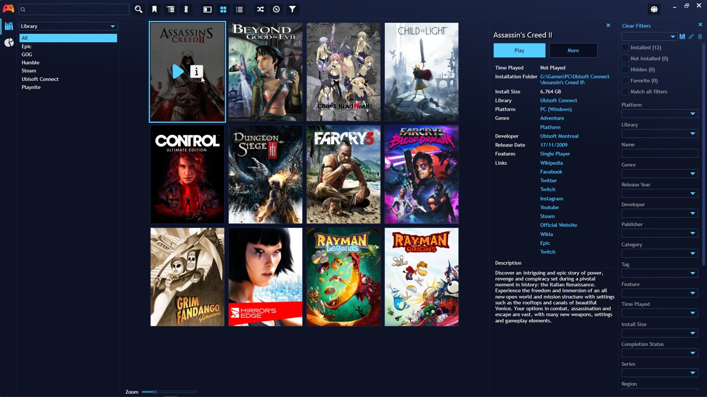
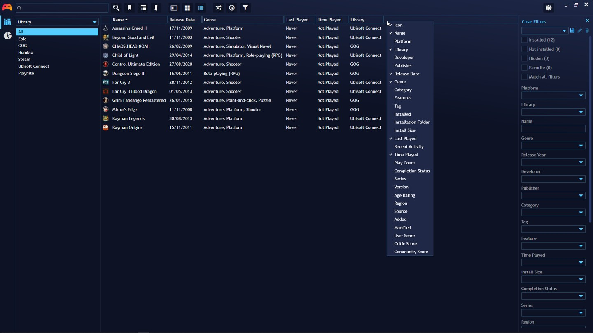
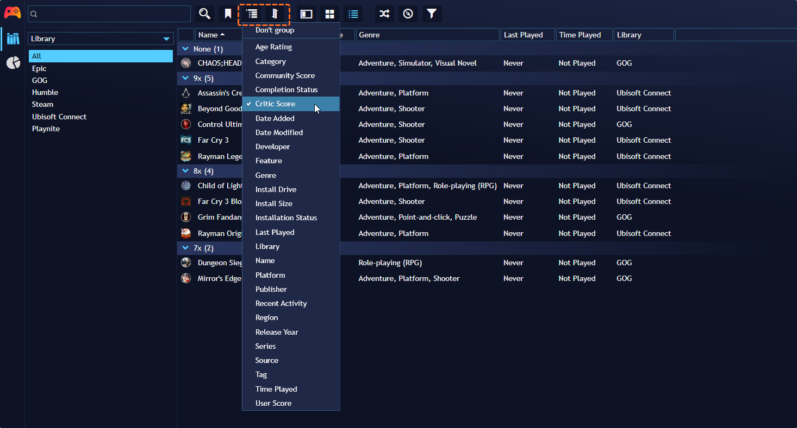

# Playnite Desktop Mode

---------------------

## Introduction

**Desktop Mode** is the standard mode in Playnite, designed for use with a keyboard and mouse. It offers extensive configuration, customization options, and features compared to **Fullscreen Mode**.

Desktop Mode consists of the following panels:

| Id  | Name                             | Description                                                                 |
| --- | -------------------------------- | --------------------------------------------------------------------------- |
| 1   | Sidebar                          | Quickly switch views or launch software added to Playnite                   |
| 2   | Top panel                        | Access game filtering, panel toggling, view switching, and various actions  |
| 3   | Explorer panel                   | Quickly filter your game library by any property                            |
| 4   | Library Panel | Displays your library and game information in Details, Grid, and List views |
| 5   | Filter panel                     | Configure filters to select what is displayed in the library panel          |

## Library Panel

### Available Library Views

Desktop Mode offers three different views for the library panel:

#### Details View

A compact vertical list view with a panel on the right displaying game details and media.

#### Grid View

Displays games in a cover format. Hovering over a game cover and clicking the ℹ️ button opens a compact panel with game details.

#### List View

Displays games in a table format with sorting support.

You can configure displayed columns by right-clicking a column header.

### Grouping and Sorting

You can group and sort the games list using the **Grouping settings** and **Sorting settings** buttons in the **Top panel**.

## Keyboard Shortcuts

Here are some keyboard shortcuts available in Desktop Mode:

### General UI

| Shortcut | Action                                                                          |
| -------- | ------------------------------------------------------------------------------- |
| `F11`    | Open Fullscreen mode                                                            |
| `CTRL-F` | Toggle **Filter panel** visibility                                              |
| `CTRL-E` | Toggle **Explorer panel** visibility                                            |
| `CTRL-D` | Open **Metadata download** window                                               |
| `F5`     | Refresh game library (also downloads a fresh game list from external libraries) |
| `F12`    | Reload script extensions                                                        |
| `F1`     | Open "About" dialog                                                             |
| `CTRL-F` | Focus on the main search box; press `ESC` or `Enter` to exit it                 |
| `Insert` | Add a new custom game                                                           |
| `CTRL-Q` | Open a wizard for emulated games                                                |
| `CTRL-T` | Access platforms and emulators settings                                         |
| `ALT-Q`  | Exit Playnite (ignores "Close" action settings)                                 |

### Game Lists

| Shortcut | Action                  |
| -------- | ----------------------- |
| `Enter`  | Start or install a game |
| `F3`     | Edit selected game(s)   |
| `Delete` | Remove selected game(s) |

### Tips

#### Selecting Multiple Games

You can select multiple games to perform various actions, such as game editing, using standard Windows methods:

| Shortcut      | Action                                             |
| ------------- | -------------------------------------------------- |
| `CTRL-A`      | Select all games                                   |
| `CTRL-Click`  | Select games while maintaining multiple selections |
| `Shift+Click` | Select a range of games                            |
