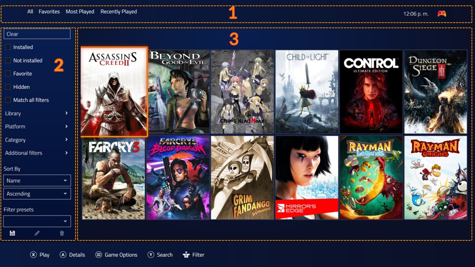
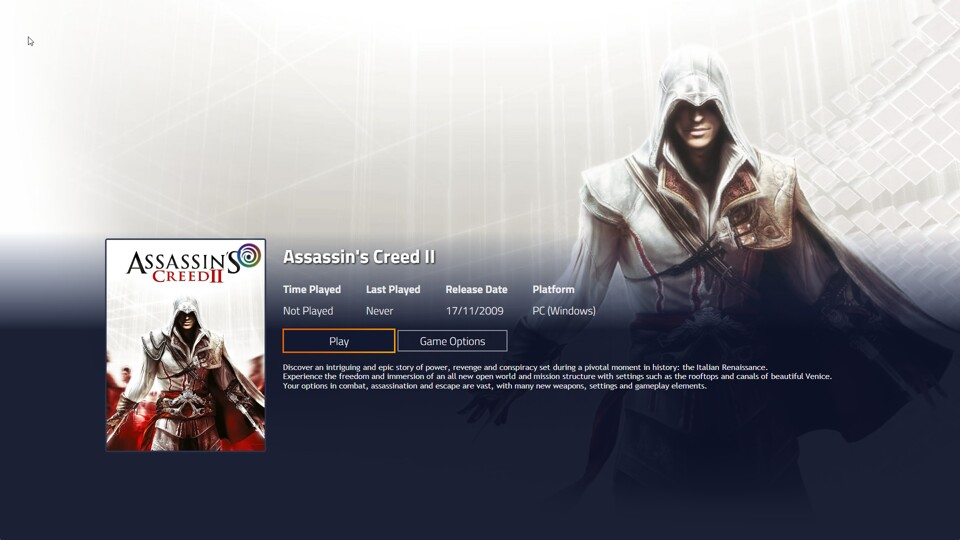

# Playnite Fullscreen Mode
---------------------

## Introduction

**Fullscreen Mode** offers controller support and is recommended for a couch or console-like gaming experience. It provides ease of use, especially when using a controller away from your PC display. You can open this mode using the Fullscreen Mode Playnite shortcut or executable. Alternatively, switch to Fullscreen Mode from Desktop Mode by pressing the `F11` keyboard shortcut, from the tray or main menu.

### User Interface

The UI consists of the following panels:

| Id | Name           | Description                                               |
|--- |--------------- |---------------------------------------------------------- |
| 1  | Top panel      | Quickly switch configured Filter Presets and open Playnite settings. Use Left and Right bumpers to switch presets. |
| 2  | Filters Panel  | Configure filters to select what should be displayed in the library panel. |
| 3  | Library panel  | Displays your library.                                    |

To open the game view, select a game and press the **Details button**, which is the **A button** by default.

### Controller Support

Controller support is currently available exclusively in Fullscreen mode. Playnite uses [SDL](https://www.libsdl.org/) library to process controller inputs. SDL supports wide range of both XInput and DirectInput joysticks and controllers. Playnite uses [community sourced database](https://github.com/gabomdq/SDL_GameControllerDB) which maps these devices to "gamepad layout" and that gamepad layout is how Playnite interprets inputs. Full button binding customization is currently not available and will be supported in Playnite 11.

If your controller is not recognized by Playnite, it's either because it's not detected/supported by SDL or there are no gamepad mappings for it available. For the latter, use one of the [mapping tools](https://github.com/gabomdq/SDL_GameControllerDB#mapping-tools) to check if your controller is working and maps to a "gamepad layout" and additionally create new mappings for it (and submit it to the same game controller database). You can then manually add new mapping into `gamecontrollerdb.txt` file found in Playnite's install folder.

If your controller is not recognized by mapping software at all, it means that SDL is not supporting it at all and you need to report the issue to SDL developers. Lastly, make sure that controller support is enabled in Fullscreen mode's input settings and that specific controllers are not disabled on the same settings page.