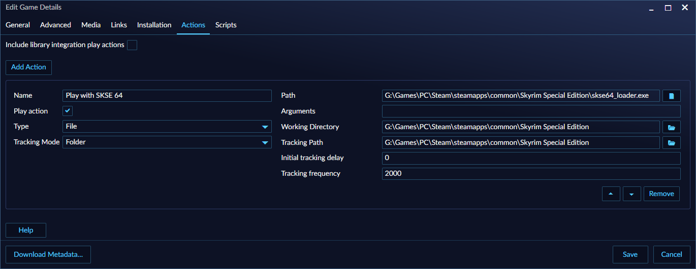

## Frequently Asked Questions (FAQ)
---------------------

### My games are gone or missing

If your games are missing, consider the following:

1. **Filtered**: Does it say "**Filter enabled**" in the top bar? If so, open the Filter Panel by clicking that button and click the `Clear filters` text at the top of the panel to remove any filters that may be hiding your games.
2. **Hidden**: If you still can't see your games, check if the game is hidden by enabling the `Hidden` checkbox in the same panel.

Another easy way to find if a game is in your library is by searching for your game using **Playnite's keyboard launcher**. For more information, refer to [here](../../features/keyboardLauncher.md).

### My games are not importing

1. Check that your library plugin is configured and authenticated correctly via `Main menu` > `Add-ons…` > `Extension settings` > `Libraries`. Make sure especially that uninstalled games are set to import if that setting is available
2. Make sure that you're logged into the right account with the library plugin
3. Check if the game is present in `Main menu` > `Settings` > `Import exclusion list`
4. Check that you don't have a filter enabled (via the filter panel) as explained in the previous section which would prevent games from being shown.

### Can I put a manually added game into a specific "Library"?

It's not possible. Manually added games will always appear under the `Playnite` library. The `Library` field specifically refers to a library plugin responsible for a game. Attempting to force a game into the `Library` would disrupt functionality, as the responsible library plugin would be unable to properly manage that game.

As an alternative you can use the `Source` field, which is user configurable.

### I uninstalled a library plugin but its games are still there, why?

Uninstalling a library plugin **does not** remove its games. Playnite never removes automatically removes a game that has already been imported to your library.

If you wish to remove the games from a certain library, you need to remove them using the methods mentioned [here](removingGames.md).

An easy way to remove them is by filtering by `Source` or `Library` in the Filter Panel and selecting all games with `Ctrl+A`.

### Can I add games that are not in my library, such as wishlisted games, console or physical games?

Yes, you can add any games to your library by manually creating a game entry for any purpose. For more information, see [here](addingGames.md#manually)

Additionally, if your purpose is only to be able to see your wishlisted games in Playnite, there are extensions made by the Playnite community for that purpose that and there are also library plugins that import games from consoles. Explore the extensions database to find them.

### Can I launch different versions of a game or launch different games from a single game entry in my library?

Yes, whether you want to launch different versions of the same game or even different games or executables you can use Game Actions for this purpose.

For more information, see [here](gameActions.md).

### My games are missing metadata, why?

In most cases, this happens when you restart Playnite after first importing games to your library while the metadata download process has not yet finished. In such cases, Playnite will not start this process again upon restart and you have to initiate this process again manually.

For more information, refer to [here](metadata.md#updating-game-metadata).

Additionally, it may be possible that your currently installed metadata plugins from which Playnite obtains this data from may not be able to provide data for all metadata fields for your games, like icons or other data. In such case, you can try installing and configuring additional metadata plugins.

If you are wondering what metadata plugins you should install, please refer to [here](../../features/extensionsSupport/faq.md#what-are-the-best-extensions-that-i-should-install).

### Filter preset selection at the top bar in Fullscreen mode doesn't show icons, why?

Playnite doesn't support icons/logos for [filter presets](../../features/filtersAndFiltersPresets.md). If you see a screenshot from custom theme that displays images as presets (for example for individual platforms), it's because that specific theme has an explicit support for it, usually done by replacing preset text with an image of the same name from theme folder. You need to consult theme's documentation for instructions how to properly set this up.

### Play Time won't sync

Play time sync is supported by specific library integration plugins. Set `Import playtime of games in library` option to `Always`  in `Settings` > `General` to force sync from remote accounts. For more information see [here](../../gettingStarted/configuringPlaynite.md#importing-playtime-from-third-party-libraries-and-services).

### Game tracking is not working correctly

When game tracking issues occur, they can introduce several problems:
- **Playtime tracking** may not work properly because Playnite cannot correctly detect when the game starts or stops.
- Playnite may incorrectly restore its window, thinking the game has stopped running when it hasn't.
- Features that depend on detecting game start/stop events, such as [Scripts](../../features/scriptingSupport/scriptingSupportOverview.md) or [extensions](../../features/extensionsSupport/extensionsSupportOverview.md) may not function correctly.

This issue often happens when a game's [Play Action](gameActions.md) is misconfigured, although it can also happen rarely with games managed by library plugins.

To fix this:

1. **For games managed by a library plugin**, create a new Play Action and set the `Path` to the game executable. Some game launchers may offer alternative methods, such as using a `Link` type, for example, Steam by using `steam://launch/<appid>`. If it's a manually added game that already has a Play Action, skip to the next step.
2. **Modify the Play Action** to ensure Playnite correctly detects when the game is running. Usually, this can be resolved by setting the Play Action `Tracking Mode` to **Folder** and configuring the `Tracking Path` to the folder where the game executable is located. Alternatively, use the `{InstallDir}` [game variable](../../advanced/gameVariables.md) if the path has been set as the `Installation Folder` under the `Installation` tab.

**Example:**

### Uninstalled games still show up as installed

Playnite automatically changes install state to uninstalled only if:

- You start uninstallation from Playnite
- You have import of uninstalled games enabled in specific integration's settings and you update the library

Installation state can be also manually change on installation tab while editing a game.

### Can Playnite detect when games are started outside of it?

No, Playnite cannot detect games started outside of it. For Playnite to track running games, they must be launched from within Playnite itself. For external game detection, Playnite and its library plugins would need to constantly monitor active processes and determine if they correspond to a game, which poses significant technical challenges. This would be complex, error-prone, and often impossible in practice.

### Can Playnite start games manually added to Steam?

Yes, Playnite can launch games that have been manually added to Steam, also commonly referred as "Non-Steam games", as well as any software that supports command line, URI, or other external launching methods through a [Play Action](gameActions.md). To launch Steam games:

1. Create a desktop shortcut for the game in Steam by right-clicking it in the Steam Library UI and selecting **Manage** > **Add desktop shortcut**.
2. Right-click the created shortcut on your desktop and copy the `URL` value (e.g., `steam://rungameid/11370944766805016576`). Alternatively, you can drag and drop the shortcut into Playnite's window to automatically create a game entry, skipping to Step 4.
3. Create a new Play Action for the game in Playnite, set the `Type` to `Link`, and paste the value from Step 2.
4. Set the `Tracking Mode` to **Folder** and configure the `Tracking Path` to the folder where the game executable is located. This allows Playnite to detect when the game is running.

### Can Playnite run games using my mod manager?

Yes, Playnite can launch modded games, provided the mod manager supports external launching. You can configure the mod manager as a [Play Action](gameActions.md) in Playnite. For specific setup instructions, refer to the mod manager's documentation, guides, or community.

**Notes:**
- In most cases, you'll need to set the `Tracking Mode` to **Folder**, and for some mod managers, you may also need to configure the `Working Directory` for the game and mod launcher to work correctly. This will depend on how each mod launcher operates.
- It is recommended to disable the **Include library integration play actions** box if you only intend to start the game with the mod manager. This option will disable showing the standard launch option provided by the game library plugin from showing.

**Examples:**

Below are examples of Play Action configurations for popular mod managers. Keep in mind that these configurations may change with updates, so treat them as informative examples only.

- Mod Organizer  
    
- Reloaded II  
    
- SKSE64 (Skyrim Script Extender)  
    
- SMAPI (Stardew Valley Modding API)  
    