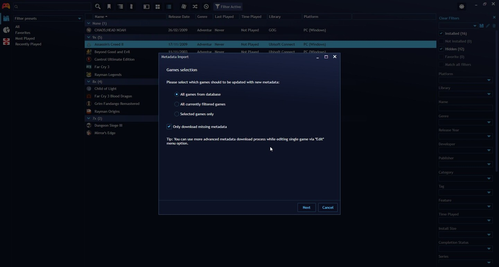
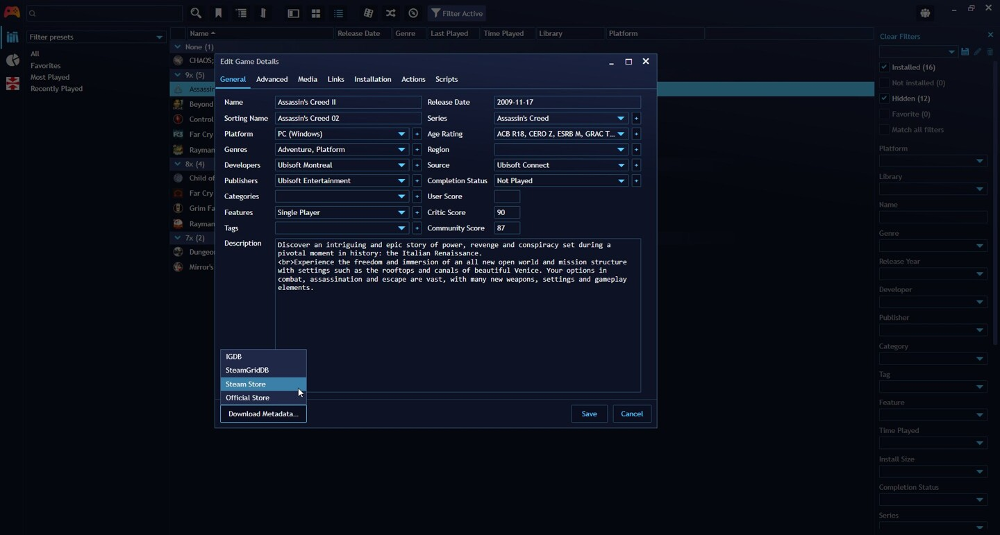

## Metadata
---------------------
### What is metadata?

Metadata refers to the additional information and details associated with your games, such as their titles, descriptions, cover art, release dates, genres, and more.

This metadata helps organize and enhance your gaming library by providing you with a comprehensive overview of your games and making it easier to browse and manage them.

### What metadata is available for Playnite?

Playnite provides access to a wide range of metadata fields and information for your games. Some of the available metadata fields include:

- **Name:** The title of the game.
- **Description:** A brief description or summary of the game.
- **Genres:** The genres that the game belongs to.
- **Release Date:** The date when the game was originally released.
- **Developers/Publishers:** The company or individuals responsible for developing and publishing the game.
- **Platform:** The gaming platform or system the game is available for.
- **Community Rating:** User-generated ratings and reviews for the game.
- **Tags:** User-defined labels or tags that you can assign to games for better organization.
- **Cover:** The visual representation of the game's cover or box art.
- **Background Image:** A background image associated with the game.
- **Links:** Links related to the game.
- and more…

These metadata fields help you keep your game library well-organized and provide valuable information about each game in your collection. You can use these details to filter, sort, and search for games, making it easier to find and manage your gaming library effectively.

For a full list of available metadata, you can right click a game and select `Edit…`.

### How is metadata obtained?
Metadata is generally obtained with metadata providers as the form of Metadata extensions, which obtain this data from third party services to Playnite to add to imported games.

To learn how to install metadata extensions to your Playnite installation see and configure them, refer to [here](../../features/extensionsSupport/installingExtensions.md#installing-additional-metadata-providers).

### Updating game metadata
By default Playnite will automatically obtain and apply to your games when you import them. If you wish to obtain metadata after first importing the games, it can be done in different ways on Desktop Mode:

1. **Bulk/Batch metadata download:** This option allows you to download metadata for multiple games. To do this, navigate to `Main menu` > `Library` > `Download metadata…`

   

> [!NOTE]
>For this option, it's possible to select multiple games. For more information, refer to [here](../../gettingStarted/playniteDesktopMode.md#tips).

2. **Single game metadata download:** Use `Right-Click` on a game and select `Edit…` in the context menu to open the Game Edit Window. Afterwards, click the `Download Metadata…` button on the bottom left of the window, select a Metadata extension you have installed and follow the instructions.

   

### Edit game metadata
Metadata can be manually edited for your games in the Game Edit Window by using `Right-Click` and selecting `Edit…`.

It's possible to edit the metadata of multiple games at the same time with this approach.

### Editing Metadata available in Library
Metadata that has been obtained for your games can be edited, modified or removed using the **Lbrary Manager**.

For more information, refer to [here](../libraryManager.md).

### Media web image search
---------------------

Web image search is available when editing game's metadata via game `Edit` dialogin the `Media` tab to obtain images for covers, background image and icon. The search can be started by clicking the "globe" 🌐 icon next to each game media type.

Available variables which can be used in search term string and will be dynamically expanded on search:

| Variable   | Description                            |
| ---------- | -------------------------------------- |
| `{Name}`     | Represents game's name.                |
| `{Platform}` | Represents first assign platform name. |

You can configure different aspects to refine your search. Additional settings are available in `Settings` > `Metadata` > `Web image search`