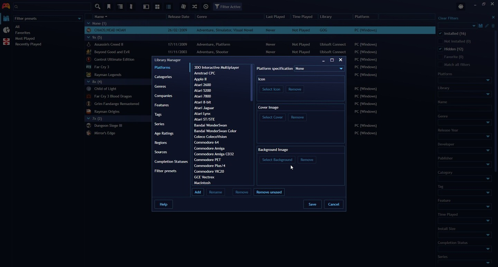

Library manager
=====================

The Library manager can be accessed by navigating to the `Main menu` > `Library` > `Library manager…` sub menu.

The purpose of the Library Manager is to manage metadata and data used in fields shared between games, including:
- Rename items
- Add new items
- Remove items
- Remove unused items in library

Additionally, certain sections have configuration options only available to them:

| Section             | Specific configuration                            |
|---------------------|-------------------------------------------------|
| [Platforms](#platforms)           | Assign custom images and Platform specification |
| Categories          |                                                 |
| Genres              |                                                 |
| Companies           |                                                 |
| Features            |                                                 |
| Tags                |                                                 |
| Series              |                                                 |
| Age Ratings         |                                                 |
| [Regions](#regions) | Assign region specification                     |
| Sources             |                                                 |
| [Completion Statuses](#completion-statuses) | Assign default completion statuses              |
| [Filter Presets](#filter-presets)           | Change presets display order, Set if preset should show in Fullscreen Mode                    |

## Sections

### Platforms
---------------------

#### Custom images

`Icon`, `Cover` and `Background` images assigned to a platform can be used as a replacement images for games that don't have any of those images assigned.

Whether platform images will be used can be controlled via application settings in `Appearance` > `Advanced` section with the `Missing game * source` options.

#### Platform specification

Platform specification fields allow you indicate to Playnite how to treat your specific platform based on internal list of built-in platforms. Setting this to correct value will improve field assignments from various automatic actions like game import or metadata import and will also prevent creation of potential platform duplicates.

If you don't see a platform on the list of platform specifications, please [open new GitHub issue](https://github.com/JosefNemec/Playnite/issues) for the platform to be added.

### Regions
---------------------

Similar to platform specifications, you can assign region specification from built-in list of regions to improve automatic game and metadata imports.

### Completion statuses
---------------------

Completion statuses view offers additional settings used to configure how Playnite handles specific statuses.

`Default status assigned to newly added games`: specify which status will be assigned to newly imported imported games with no play time recorded yet.

`Status assigned to games played for the first time`: specify which status will be assigned to games played for the first time.

### Filter Presets
---------------------

In this section you can do the following:

1. **Change Filter Presets display order:** Select an item and use the `Up` and `Down` buttons to the order you want
2. **Change Ffilter preset configuration:** including if they should display in Fullscreen Mode.